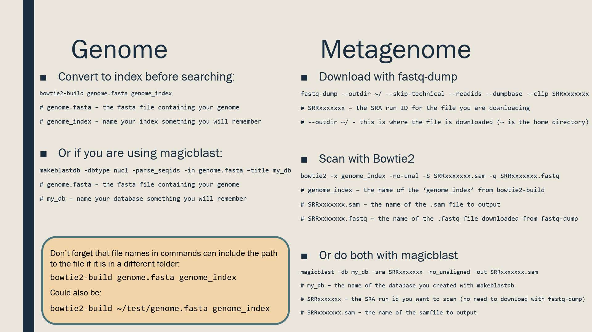

# Applied Bioinformatics for Biologists  
The goal of this course material is to give biologists in the experience and skills necessary to survive a post-Next-Generation-Sequencing workplace.  
  
When biologists learn organic chemistry, they often do simple experiments like synthesizing aspirin from salicylic acid which has become a common exercise in organic chemistry labs. These materials aim to serve as a similar curriculum, introducing biologists to the skills and concepts critical to understanding and performing bioinformatic tasks.  
  
## Prerequisites  
Students should have completed some undergraduate course work in biology, specifically genetics, microbiology, and ecology. Additionally, students from computer science backgrounds should be familiar with SSH, BASH, and basic Unix commands if they hope to compensate for a lack of biological training. **However, no background in bioinformatics or computer science is required for this material.**  
  
## Modules  
While the modules below follow a specific order, each one can be taught independently to train students on specific skills.  
  
Module | Title | Skill | Time 
------ | ----- | ----- | ---- 
1 | Intro to Bash | Basic Unix, Don't fear the terminal! | 1 Week
2 | SSH and Keys | Logging into remote computers (Jetstream/AWS) securely | 1-2 Weeks
3 | Downloading SRA Metagenomes & Read Mapping | Downloading and searching a single SRA dataset for matching DNA using Bowtie2 | 2 Weeks
4 | Bash Variables and Loops | Using a small loop to automate big tasks | 1-2 Weeks
5 | Mini Project | Project proposal and rejection, practice with modules 1-4, and scientific writing | 3-5 Weeks
6 | Final Project | Critical thinking, planning, creativity, guided research. Covers modules 1-5 | 4-6 Weeks
7 | Video Presentations | (optional) From the Microbial Metagenomics Discovery Challenge 2017 | 1 Week
Total | | | 12-19 Weeks

## I'm very busy; sum the course into one picture for me.

